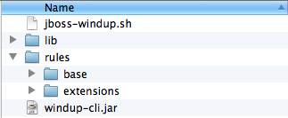
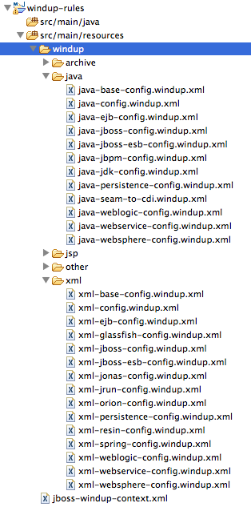

In an effort to reduce the overhead in testing out Windup configurations, the Windup Extension framework has been put in place.  

When Windup is downloaded, there is a folder `windup-cli/src/main/assembly/extensions`.  Within that folder, extensions to Windup can be added to different pipelines, such as the XML or Java rule pipelines.

```xml
<windup:pipeline type="JAVA" id="java-extension-decorators">
  <windup:java-classification regex="com.example.clz.ClzName$" description="Testing Extension Framework" />
</windup:pipeline>

<windup:pipeline type="XML" id="xml-extension-decorators">
  <windup:xpath-classification description="Windup Example" xpath="/windup:example">
    <windup:namespace prefix="windup" uri="http://windup.com/example/namespace" />
  </windup:xpath-classification>
</windup:pipeline>
```

To plug in a new extension, simply define a new XML file within the extensions folder.  **The file must use the the file extension ".windup.xml".**



Want some examples of the things you can do with Windup?  See the Source!  All existing Windup rules can be found within `/windup-rules/src/main/resources/windup`, and pull requests are welcome if you would like to contribute more functionality.



**Ready to write some rules?  Check out [Writing Windup Rules](https://github.com/jboss-windup/windup/wiki/6.0-Coding-Windup-Rules)!**

[Previous Page: 3.0 Execute Windup](3.0-Execute-Windup)

[Next Page: 5.0 Reviewing Windup Report](5.0-Reviewing-the-Report)