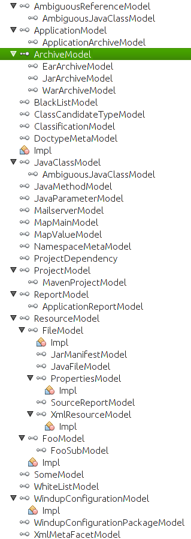

Windup models are the classes extending WindupVertexFrame.

## Meta models
* User input
* Rules and Rule Providers metadata

## Core models
FileModel
ArchiveModel

## Reporting models

## Custom models (coming from Addons)
See respective ruleset's documentation.

