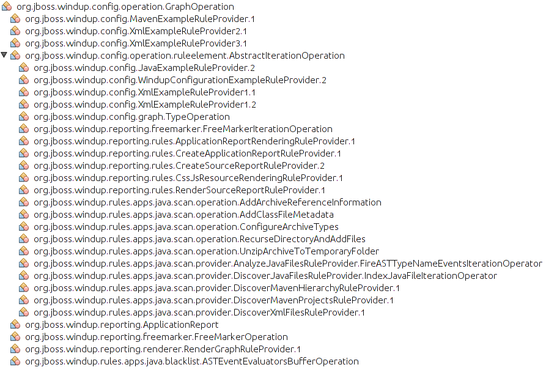

An operation is a task which can be invoked from within a rule.

It is created by extending GraphOperation.

```java
public class FooOperation extends GraphOperation
{
    @Override
    public void perform(GraphRewrite event, EvaluationContext context)
    {
        
        ...
    }
}
````

Existing operations:

